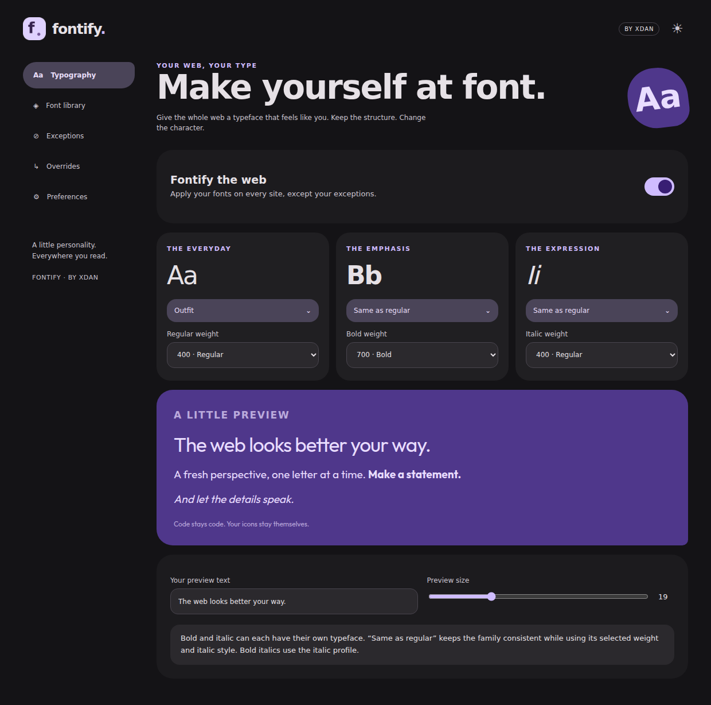

<div align="center">


# Fontify

**Your web, your type.**

A Chrome & Firefox extension by **XDan**. Make the web feel like you, with Material 3 Expressive controls, your favourite typefaces, and a little attention to the details.

[](https://github.com/XDanfr/Fontify/actions/workflows/build.yml)
[](LICENSE)

</div>

## What you can do

- Pick from **1,950 Google Fonts families** in a bundled searchable catalogue. Filter by category, save favourites, and preview fonts on hover or keyboard focus. No API key needed.
- Upload **TTF/OTF** fonts, including variable fonts. Files stay on your device. Static faces keep their original weight and italic descriptors; variable faces retain their weight range.
- Choose separate **regular, bold and italic** families and weights. Bold italics use the italic profile. If a family has no italic face, the browser can synthesise it.
- Leave **monospace text, code and icon fonts** alone by default. Detection uses known font families and fixed-pitch measurements.
- Highlight text, right-click **Fontify**, and override either its original font family or that text/code block. Choose a replacement font, weight, and scope. Rules persist across reloads; a block rule is scoped to its host.
- Add exceptions for a **website, font family, or CSS selector**. Exceptions win over overrides, including within restyled parent elements.
- Pause Fontify globally or on the current site, without reloading. The original inline values and priorities are restored.
- Switch between **light, dark and system** themes. The corner toggle switches light/dark. Reduced-motion preferences are respected.
- Export/import settings, exceptions, rules and custom fonts in a single backup. Pause remote downloads or clear the Google font cache.



## Install a development build

Download the latest **fontify-packages** artifact from [Actions](https://github.com/XDanfr/Fontify/actions/workflows/build.yml), or build locally. Tag builds also attach packages to [Releases](https://github.com/XDanfr/Fontify/releases).

### Chrome / Chromium

1. Extract `fontify-1.0.0-chrome.zip`.
2. Open `chrome://extensions` and enable **Developer mode**.
3. Choose **Load unpacked** and select the folder containing `manifest.json`.
4. Refresh any already-open websites once after installation. Later settings changes apply live.

A CRX3 package is also built. A self-signed CRX is useful for compatible development/managed distribution, but is **not** a Chrome Web Store signature and cannot be installed on every standard Chrome platform by double-clicking. Load unpacked is the reliable development route. Chrome 120 or newer is required.

### Firefox

1. Extract `fontify-1.0.0-firefox.zip`.
2. Open `about:debugging#/runtime/this-firefox`.
3. Choose **Load Temporary Add-on** and select `manifest.json`.
4. Refresh already-open websites once after installation.

Temporary add-ons are removed when Firefox restarts. The unsigned XPI is a development package; normal persistent Firefox installation requires Mozilla signing. The workflow can produce an **unlisted signed XPI** when AMO credentials are configured. Firefox 140 or newer is required.

## Build & test

Use Node.js 22 or newer:

```sh
npm ci
npm test
npm run build
npm run lint:firefox
npx playwright install --with-deps chromium
npm run test:browser
npm run package
```

Output:

| File / directory                       | Purpose                                                |
| -------------------------------------- | ------------------------------------------------------ |
| `dist/chrome/`                         | Unpacked Chromium MV3 build; service worker background |
| `dist/firefox/`                        | Firefox MV3 build; event-page background               |
| `artifacts/fontify-1.0.0-chrome.zip`   | Chrome development/store upload package                |
| `artifacts/fontify-1.0.0-firefox.zip`  | Firefox source package                                 |
| `artifacts/fontify-1.0.0.crx`          | Self-signed CRX3                                       |
| `artifacts/fontify-1.0.0-unsigned.xpi` | Unsigned Firefox development package                   |

`npm run catalogue:update` refreshes the Google Fonts metadata snapshot. Catalogue access is never needed during an ordinary build. Fonts themselves download on demand through the background extension context and are cached in IndexedDB. All executable code and UI assets are bundled locally.

Browser tests run the actual Chrome extension against a local fixture, with deterministic Google font responses. They cover page security restrictions, dynamic text, open shadow roots, code/icon protection, family selection, uploads, exceptions, persisted code-block overrides, restoration and light/dark UI. Unit tests cover settings, rule precedence, family safety and uploaded font metadata. Firefox is manifest/lint validated; the automated interactive integration suite uses Chromium.

Mozilla's linter currently reports one `UNSAFE_VAR_ASSIGNMENT` warning in the bundled Lit dependency's template parser. Application strings are passed through Lit's escaped bindings; Fontify does not use `unsafeHTML` or remote executable code. Review this known dependency warning during store submission rather than suppressing it.

## Automated builds and signing

Every push to `main` and every pull request builds, tests, validates, packages, and uploads artifacts. Tags matching `v*` also create GitHub Releases.

Optional repository **Actions secrets**:

| Secret               | Purpose                                                                                                        |
| -------------------- | -------------------------------------------------------------------------------------------------------------- |
| `CHROME_PRIVATE_KEY` | PEM RSA private key for a stable CRX extension identity. Without it, CI generates a development key per build. |
| `AMO_JWT_ISSUER`     | Mozilla Add-ons API key for signing tag builds                                                                 |
| `AMO_JWT_SECRET`     | Matching Mozilla Add-ons API secret                                                                            |

The Chrome private key is never included in published artifacts. A first local package build creates `artifacts/development-key.pem`; preserve it privately if you want the same local CRX identity. For local signing with another key, set `CHROME_KEY_PATH` to its path.

See [release instructions](docs/RELEASING.md) for the exact steps. Store submission and credential creation are not automated.

## Behaviour and boundaries

- Profiles apply to normal webpage text, form controls, dynamically inserted text, iframes where permitted, and open shadow roots. An explicit saved override can opt code/monospace text into replacement. Icons remain protected.
- Site patterns use exact hostnames; `*.example.com` includes the parent and its subdomains. Path-specific exceptions are not supported. A most-recent matching override wins; exceptions take priority.
- Block selectors may stop matching if a website redesigns its DOM. Recreate that rule when needed. Persistent block overrides cannot target inside a shadow root; use a font-family rule there.
- A font is applied only once its data loads. Failed downloads leave the original page typography in place. If downloads are disabled, uncached Google fonts cannot load; cached/custom fonts remain usable.
- Static uploaded fonts cannot acquire true weights they do not contain. The browser uses the closest face and may synthesise bold or italic. Use variable fonts or separate uploaded faces for precise results.
- Browser settings pages, extension stores, built-in PDF viewers, canvas-rendered text and closed shadow roots are outside the extension's reach. Fonts inside inaccessible frames cannot be changed.
- Restyling may change line wrapping and layout. No extension can guarantee identical page layout with a different typeface.

## Privacy & permissions

No analytics, accounts, history collection, or external settings sync. Custom files and backups stay local unless you choose to share an exported backup. Selected text is stored locally only while composing an override, and its short label is retained in a saved rule. See [Privacy](docs/PRIVACY.md).

`storage` saves settings; `contextMenus` adds right-click actions; `activeTab` identifies the page used by the popup. Access to websites lets the content script replace typography and permits the background to download Google font assets. The extension does not use an external server.

## Licence & credits

**MIT**, copyright 2026 XDan. Built with [matraic/m3e](https://github.com/matraic/m3e), with the visual direction of [XDan's site](https://github.com/XDanfr/xdan.me): Outfit, rounded tonal surfaces, expressive shapes, and restrained motion.

The UI's bundled Outfit font is SIL OFL licensed. See [third-party notices](THIRD_PARTY_NOTICES.md) and the packaged `licenses/` directory. Uploaded fonts remain subject to their own licences.
